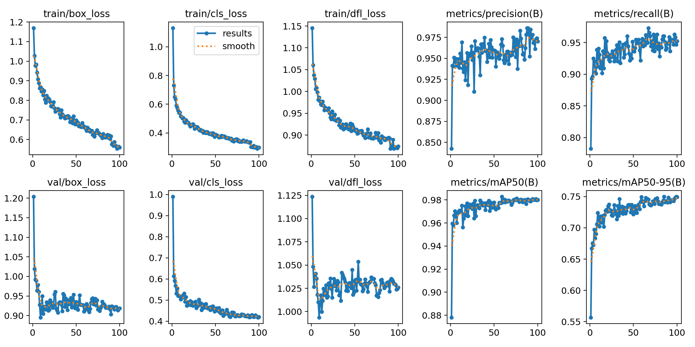
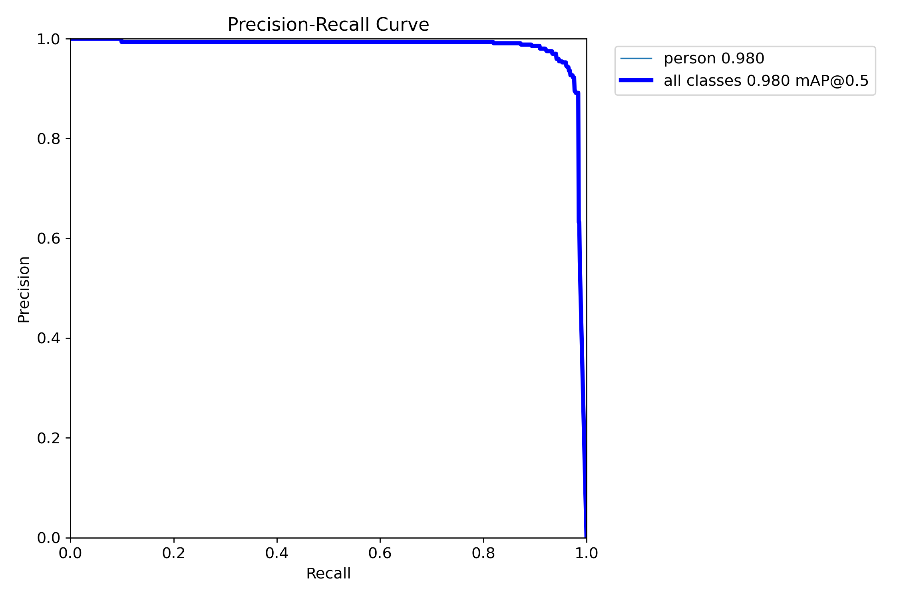
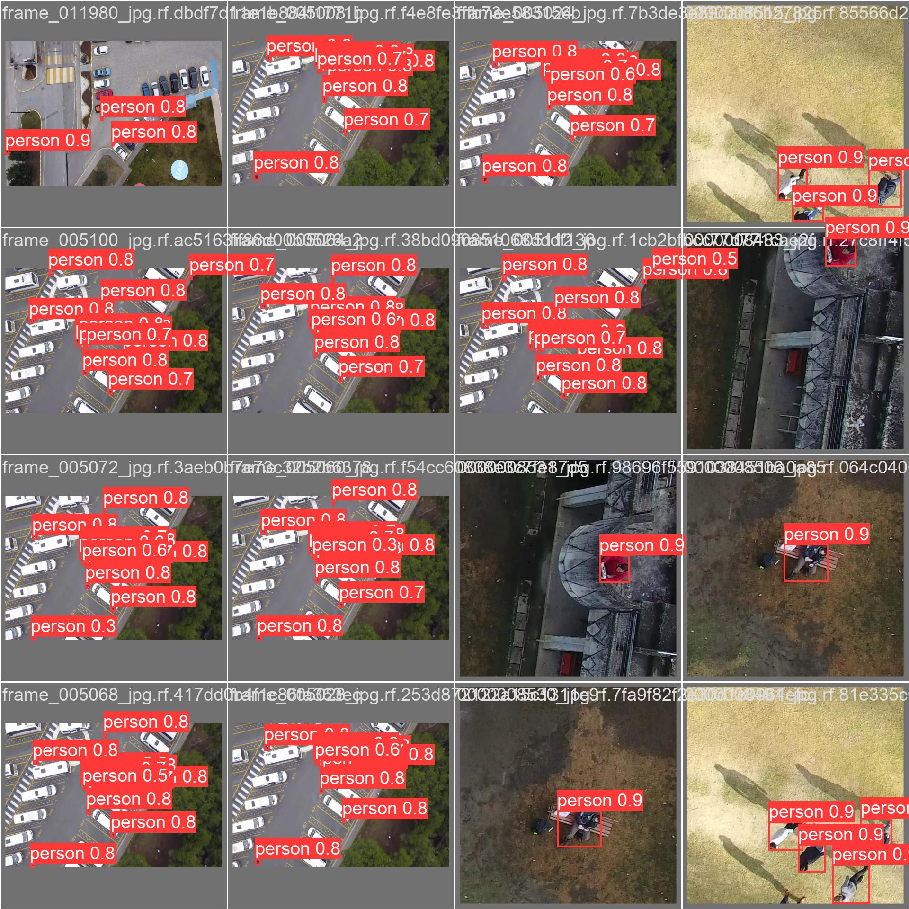

# Human-detection with YOLOv8
This is a project with which you can detect people in images taken from UAVs. You can use either a pre-trained model or train it yourself.
## Metrics and losses of pre-trained YOLOv8-s for human-detection
### Graphs of mAPs and errors (box and classification)


### There is a PR-curve below



### Predictions based on some examples from the validation dataset



All augmentations that were applied to the input images during training were taken from YOLOv8 `default.yaml` file.

Input dataset was made by combining three datasets from [Roboflow](https://universe.roboflow.com/):
* [First](https://universe.roboflow.com/sakarya/kontrol-gx8vv/dataset/2)
* [Second](https://universe.roboflow.com/ssb/ssb_sakarya)
* [Third](https://universe.roboflow.com/j3ssus/pedestrian-detection-uni/browse?queryText=&pageSize=50&startingIndex=0&browseQuery=true)
## Getting started
Before you start working, you need to install all the working dependencies.
```commandline
python -m pip install --upgrade pip
pip install -r requirements.txt
```
## Inference
### Inference on a single image
If you want to run the model on a single image, then you need to run the following Python code:
```python
from inference_one_image import inference

inference(
    path_to_model=None, # If None, pretrained yolo will be downloaded, else your model path 
    path_to_image='./defaults/img_1.jpg', # Choose your image path
)
```

Or use the command line:
```commandline
export PATH_TO_MODEL=/path/to/your/model/if/exists
export PATH_TO_IMAGE=/path/to/your/image

python inference_one_image.py --path_to_model $PATH_TO_MODEL --path_to_image $PATH_TO_IMAGE
```
### Inference on a single video
If you want to run the model on a single video, then you need to run the following Python code:
```python
from inference_video import inference

inference(
    path_to_model=None, # If None, pretrained yolo will be downloaded, else your model path 
    path_to_video='./defaults/video_1.mp4', # Choose your video path
)
```

Or use the command line:
```commandline
export PATH_TO_MODEL=/path/to/your/model/if/exists
export PATH_TO_VIDEO=/path/to/your/video

python inference_video.py --path_to_model $PATH_TO_MODEL --path_to_video $PATH_TO_VIDEO
```
### Tracking and speed estimation
If you want not only to run the model on video, but also to track people with speed estimation, then you can use the `tracking_on_video.py` file.
```python
from tracking_on_video import tracking

tracking(
    path_to_model=None, # If None, pretrained yolo will be downloaded, else your model path 
    path_to_video='./defaults/video_1.mp4', # Choose your video path
)
```

Or use the command line:
```commandline
export PATH_TO_MODEL=/path/to/your/model/if/exists
export PATH_TO_VIDEO=/path/to/your/video

python tracking_on_video.py --path_to_model $PATH_TO_MODEL --path_to_video $PATH_TO_VIDEO
```

## Training
### You can create your own dataset (*optional*)

You can make your own dataset. By clicking on the [link](https://drive.google.com/file/d/1dAjNMyxm8inWyXslofD0axKiXIo5DS4y/view?usp=drive_link), you can download a smaller version of Stanford Campus Dataset (downloaded and zipped from Kaggle), then use the `video_to_frames` method from the `utils.py` file and slice the video clips from the dataset into frames. First 100 frames of the video will be saved by default.

If you want to train your own YOLOv8 human-detection model, you can do this using `train_yolo.py` file.
```python
from train_yolo import train_yolo

train_yolo(
    dataset_yaml_path='/path/to/your/dataset.yaml',
    imgsz=640, # Choose your input image size
    batch=8, #Choose your batch size
    epochs=100, #Choose the number of epochs
    lr0=0.0001, #Choose your initial learning rate
    project='/path/to/save/training/runs',
    name='name_of_your_experiment'
)
```

Or use the command line:
```commandline
export DATASET_YAML_PATH=/path/to/your/dataset.yaml
export BATCH=8
export EPOCHS=100
export LR=0.0001
export PROJECT=/path/to/save/training/runs
export NAME=name_of_your_experiment

python train_yolo.py --dataset_yaml_path $DATASET_YAML_PATH --batch $BATCH --epochs $EPOCHS --lr0 $LR --project $PROJECT --name $NAME
```
Result (such as best weights, metrics, scalars) will be saved to `/path/to/save/training/runs/name_of_your_experiment`.


