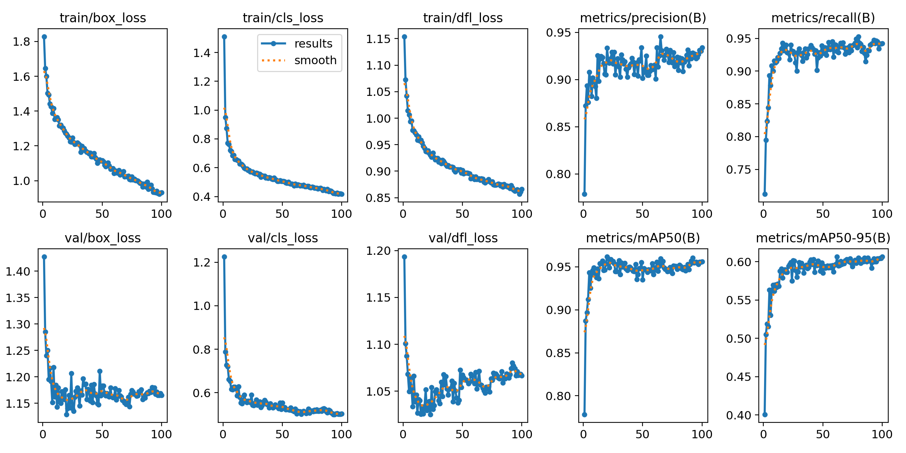
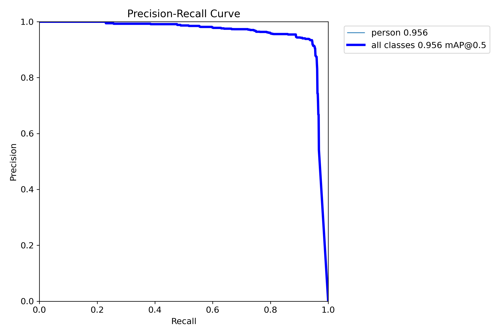

# Human-detection with YOLOv8
This is a project with which you can detect people in images taken from UAVs. You can use either a pre-trained model or train it yourself.
## Metrics and losses of pre-trained YOLOv8-s for human-detection
### Graphs of mAPs and errors (box and classification)


### There is a PR-curve below



### Predictions based on some examples from the validation dataset


All augmentations that were applied to the input images during training were taken from YOLOv8 `default.yaml` file.

Input dataset was made by combining three datasets from [Roboflow](https://universe.roboflow.com/):
* [First](https://universe.roboflow.com/sakarya/kontrol-gx8vv/dataset/2)
* [Second](https://universe.roboflow.com/yolov5-human-detection/human-detect-v2/dataset/1)
* [Third](https://universe.roboflow.com/j3ssus/pedestrian-detection-uni/dataset/2)
## Getting started
Before you start working, you need to install all the working dependencies.
```commandline
python -m pip install --upgrade pip
pip install -r requirements.txt
```
## Inference
### Inference on a single image
If you want to run the model on a single image, then you need to run the following Python code:
```python
from inference_one_image import inference

inference(
    path_to_model=None, # If None, pretrained yolo will be downloaded, else your model path 
    path_to_image='./defaults/img_1.jpg', # Choose your image path
)
```

Or use the command line:
```commandline
export PATH_TO_MODEL=/path/to/your/model/if/exists
export PATH_TO_IMAGE=/path/to/your/image

python inference_one_image.py --path_to_model $PATH_TO_MODEL --path_to_image $PATH_TO_IMAGE
```
### Inference on a single video
If you want to run the model on a single video, then you need to run the following Python code:
```python
from inference_video import inference

inference(
    path_to_model=None, # If None, pretrained yolo will be downloaded, else your model path 
    path_to_video='./defaults/video_1.mp4', # Choose your video path
)
```

Or use the command line:
```commandline
export PATH_TO_MODEL=/path/to/your/model/if/exists
export PATH_TO_VIDEO=/path/to/your/video

python inference_video.py --path_to_model $PATH_TO_MODEL --path_to_video $PATH_TO_VIDEO
```
### Tracking and speed estimation
If you want not only to run the model on video, but also to track people with speed estimation, then you can use the `tracking_on_video.py` file.
```python
from tracking_on_video import tracking

tracking(
    path_to_model=None, # If None, pretrained yolo will be downloaded, else your model path 
    path_to_video='./defaults/video_1.mp4', # Choose your video path
)
```

Or use the command line:
```commandline
export PATH_TO_MODEL=/path/to/your/model/if/exists
export PATH_TO_VIDEO=/path/to/your/video

python tracking_on_video.py --path_to_model $PATH_TO_MODEL --path_to_video $PATH_TO_VIDEO
```

## Training
### You can create your own dataset (*optional*)

You can make your own dataset. By clicking on the [link](https://drive.google.com/file/d/1dAjNMyxm8inWyXslofD0axKiXIo5DS4y/view?usp=drive_link), you can download a smaller version of Stanford Campus Dataset (downloaded and zipped from Kaggle), then use the `video_to_frames` method from the `utils.py` file and slice the video clips from the dataset into frames. First 100 frames of the video will be saved by default.
### Roboflow datasets preparation for training
#### How to download datasets
Click on the link to the dataset and then click on the `Download Dataset` button. Select the `download zip to computer` option and click `continue`.

After you download all three datasets from [Roboflow](https://universe.roboflow.com/) in zip format to your computer, follow these steps to create a general dataset:
* Create a folder named `general_dataset` in project root, inside which also create two empty folders `valid` and `train`. In each of the `valid` and `train` folders, create two empty folders named `images` and `labels`.
You should have the following structure:
```
general_dataset
└───train
    └───images
    └───labels
└───valid
    └───images
    └───labels
```

* Go to the folder with [first](https://universe.roboflow.com/sakarya/kontrol-gx8vv/dataset/2) dataset, it contains only `train` folder. Inside the folder of this dataset, you need to create a `valid` folder, inside which the `images` and `labels` folders should be created.Move following images 
```
0000000002_jpg.rf.99ed5c6f7c66be6eed3e9117c922c17e.jpg
0000000008_jpg.rf.f5201dc42fd968fbc57f0f693f042319.jpg
0000000026_jpg.rf.54f35243d0c5157269143e4d68105e1c.jpg
0000000027_jpg.rf.3aa406a15c7a9149ec06cba3dc5cb935.jpg
0000000050_jpg.rf.40188247cacdc885be7d9bf46ba20cf7.jpg
0000000056_jpg.rf.93f528711aff1ad86beed706f590645c.jpg
0000000074_jpg.rf.5ddc3b8b40870aecbfa16b4487882d6a.jpg
0000000075_jpg.rf.103f816b13a6de2270c30b480c3c2885.jpg
0000000080_jpg.rf.664e7c5e8c90b2f38b23c88826aa0059.jpg
0000000097_jpg.rf.c04a2d0021aa5e792aaa1285fbd8999a.jpg
0000000098_jpg.rf.d0dfb182e5c0f76b0be5cf59e930a1ee.jpg
0000000121_jpg.rf.2cddbeac068a2a5ccd94d3f76d605c67.jpg
0000000122_jpg.rf.01161a609b2d06ce48ada00599cd1aa7.jpg
0000000123_jpg.rf.0f832964e3cf890d3b6963c8542fd3e1.jpg
0000000145_jpg.rf.794f47e879d671291ce0dd81b7f7fe13.jpg
0000000146_jpg.rf.7eed2b0ecd595b08e007b98bcaf81b92.jpg
0000000147_jpg.rf.0c764774c0e12dabb36fb74774c9fa7f.jpg
0000000169_jpg.rf.1d90baa615295ead0d7a0c8de96a9fec.jpg
0000000170_jpg.rf.7e9a0c1823d1767a5610f0b9084623e1.jpg
0000000171_jpg.rf.1b34d7b2195345828091878173bd1d5a.jpg
0000000193_jpg.rf.05560f747c800b1eb1b8c953d8faf4ee.jpg
0000000194_jpg.rf.cba125c6b4af7312e3221ed3b4adc33d.jpg
0000000195_jpg.rf.b0eef00986a913b7d8a0a6c704b9c651.jpg
0000000203_jpg.rf.a5260fec2500ed6b811a9b530a4db3c7.jpg
0000000217_jpg.rf.f1b3a3fb2e80ed7d0be7ea930235781d.jpg
0000000218_jpg.rf.8c7d8ddaf6020e42facaf238af922422.jpg
0000000219_jpg.rf.e51365359ab18525fa38e2dadb3f37cb.jpg
0000000227_jpg.rf.2720d344783d36da6a04b49d67ebaf66.jpg
0000000241_jpg.rf.ea56a7d2968c289b3146362afc7383f5.jpg
0000000242_jpg.rf.2eda2627baa9a37615e92afb9f06d410.jpg
0000000243_jpg.rf.4382627c0e566b07d5aec87af9b4ee6f.jpg
0000000251_jpg.rf.82f8929b0baf1a1d42c5e0c7560c92f1.jpg
0000000289_jpg.rf.5d5ab32b815ace89c52a9f2cf423d7b7.jpg
0000000290_jpg.rf.8818461a4c7787d8f13f19d7fcdd03ec.jpg
0000000291_jpg.rf.4f2889d10a17f483e5df1b882cc1817c.jpg
0000000314_jpg.rf.90757761d9cac88380b8348051073e6a.jpg
0000000320_jpg.rf.03ca84e03d9342734b9ffbbc9c773954.jpg
0000000339_jpg.rf.128dd042697fcde1806a96e3fc991cb5.jpg
0000000342_jpg.rf.76dfeed05d5842045161ca5eb5bfab80.jpg
0000000346_jpg.rf.f0f6ff2f187ba1cd82f36f6b09e0b211.jpg
0000000362_jpg.rf.1b42f45f0d2b14212bfd904b34c5bf68.jpg
0000000363_jpg.rf.b17d918657149f617d80990382aa02f7.jpg
0000000366_jpg.rf.7fb410c7e2956682ab49c5713623ba23.jpg
0000000367_jpg.rf.bc621e6ffb9c50143252d214baf45537.jpg
0000000370_jpg.rf.fe01179a16c1994032d87b0bf0c4859f.jpg
0000000387_jpg.rf.d2e5890507a0d2df80f661732e2a8ca4.jpg
0000000390_jpg.rf.c8a0276e5121704136c860f02b9dfd6c.jpg
0000000391_jpg.rf.e3f9d7f077c1d2d48bc6f39a65635248.jpg
0000000392_jpg.rf.1dbd7ae0f64e8add96e7d8021d770f13.jpg
0000000414_jpg.rf.ecbbc209ce606d13b35ce154f75465c7.jpg
0000000415_jpg.rf.5898421467945bd53bfaa9cfc6f69a7e.jpg
0000000438_jpg.rf.1a86507660695a53ec99fc9d0a4079b7.jpg
0000000439_jpg.rf.566ebafe1811b5d62c5bbf90171f79ea.jpg
0000000441_jpg.rf.60e5a32f0aa34da4fc613d2d6eb99365.jpg
0000000449_jpg.rf.416f0bb2e844c725b4cb6e08593bc4a3.jpg
0000000455_jpg.rf.b967cd65617582feffecb48b5e3425e7.jpg
0000000462_jpg.rf.de1feae9dc565efe2db440461e78ad5c.jpg
0000000463_jpg.rf.83a1ad73f7eb859d313d4b71e5f70e16.jpg
0000000465_jpg.rf.2c22b8b5a3396a7460c0041630ae7e9e.jpg
0000000473_jpg.rf.5d85775add2ab178c85fd5c85de8dfb7.jpg
0000000479_jpg.rf.a08cf61e85e140543d50cb1642e151b2.jpg
0000000487_jpg.rf.1e9b3f4228896c87a4d4d82243eaffdd.jpg
0000000488_jpg.rf.3b8c465b77ed8a8a2726f36ede13b712.jpg
0000000490_jpg.rf.bd27d123747097d970dff67da17a9d36.jpg
0000000511_jpg.rf.5bd784ebe4d52bf835b3baf8270ba3b5.jpg
0000000512_jpg.rf.48af156387a530705ba2de2bc5489f63.jpg
0000000513_jpg.rf.965f7584d198b7745aebbc62bddd0b3f.jpg
0000000560_jpg.rf.d0bdb833d8c6f4bf1e189aee6de574a5.jpg
0000000561_jpg.rf.e78ddcb9a871bb1904e9e306c5c4b9a4.jpg
0000000567_jpg.rf.2f2534ffd6a33b61b7e37d5208a425e7.jpg
0000000584_jpg.rf.822671062325911d6efe1bd5befb9e21.jpg
0000000585_jpg.rf.faa84ad0c727ddc7c663f62017047687.jpg
0000000591_jpg.rf.45b96a63825eaf54965233102813dca4.jpg
0000000609_jpg.rf.b379747e7fd503cc59359357e7242135.jpg
0000000615_jpg.rf.9670b50c075112613e8966332c964970.jpg
0000000632_jpg.rf.5d037061070320c57a503630445d159f.jpg
0000000633_jpg.rf.ed024386f04f2afa9ef6093fa3a7e7ba.jpg
0000000639_jpg.rf.8d95c970eab183da998935a2d429201b.jpg
0000000645_jpg.rf.4574cf8118ce14cab00c5d6d4886a1e2.jpg
0000000656_jpg.rf.fc9ec4c37c4b88cee9f40acf97ca3eda.jpg
0000000657_jpg.rf.da6ad059cff02cf7fc9ebd2e461909f0.jpg
0000008000_jpg.rf.d210d5e2663076422350ed3a253e20f6.jpg
0000008002_jpg.rf.d80fb42886f01ff9a0b84192872a93b4.jpg
0000008018_jpg.rf.c47fe6d40a77a4c5de479c62ea4dfb64.jpg
0000008023_jpg.rf.de9669785cf4fe586b5b6c764a939f64.jpg
0000008024_jpg.rf.d0201946a150b0be4a0bb036861d812f.jpg
0000008026_jpg.rf.39972aa7b20d3c82119bff09370f3694.jpg
0000008042_jpg.rf.ef75ab78a459b21f079627f2d73cac49.jpg
0000008047_jpg.rf.3417ee0fed3bafc052e404c054d8cc51.jpg
0000008048_jpg.rf.11ac1787d54497bc8c95f3c23a372191.jpg
0000008050_jpg.rf.479e0b9883800266b27ab5f4b90333ce.jpg
0000008066_jpg.rf.77e731832d7a2606100cbad44dd6eb1e.jpg
0000008071_jpg.rf.eac5b24d53b6c96b7864b1719907c8b7.jpg
0000008072_jpg.rf.eb172fca19a0ef387951dfb465cca2e0.jpg
0000008073_jpg.rf.44899038514c34a03d75f257714dc82b.jpg
0000008090_jpg.rf.d9fa73b7733ea00f7f0e14e3d413aa33.jpg
0000008095_jpg.rf.53f63cc5c9d90336e218158ed413f8cd.jpg
0000008096_jpg.rf.dd7ba95b56a237f9dd5d4309a57b2256.jpg
0000008097_jpg.rf.368f3259987e27d19db7915e4a94687c.jpg
0000008114_jpg.rf.68d40a2bcec4eb82d021a87ebe0100c6.jpg
0000008119_jpg.rf.6471b39081951a4596414251f44cb25f.jpg
0000008120_jpg.rf.4ecca1a87e1e4c0be5eb2f78f5953520.jpg
0000008121_jpg.rf.d9b4ce2bf1a6f5af0e040bebfe3ab861.jpg
0000008138_jpg.rf.50c77787da93dee86289562841739fa5.jpg
0000008143_jpg.rf.d63faf5563004074bb1072d449b769d9.jpg
0000008145_jpg.rf.5a1518eb5cabdef362c3684b162cfb6f.jpg
0000008162_jpg.rf.0be82542668814e3750f64dd7d4e3175.jpg
0000008167_jpg.rf.cce039d8718f3bcfcd57af8a0e48545e.jpg
0000008175_jpg.rf.3b2779a70d34357b168f8ca7609a61cb.jpg
0000008186_jpg.rf.5991b19fa198073da3dd4d98bd4307e7.jpg
0000008191_jpg.rf.805618fde6984058707644e94f8a50a7.jpg
0000008197_jpg.rf.0b338e3d379991bbc8d9491fbe7b6f79.jpg
0000008199_jpg.rf.5bc70f93e4c93d898b9370576062fbb7.jpg
0000008215_jpg.rf.f1168a9e9b852366d45aca4ccee1bacc.jpg
0000008216_jpg.rf.fe9172db93edd3f19518660db4dd6e6c.jpg
0000008221_jpg.rf.5e36c63b0c0456c6c7d958dfd8efbbee.jpg
0000008223_jpg.rf.5a74942b2b22b87ba472934c1dd1ee02.jpg
0000008236_jpg.rf.0f25f6f2dd3d9ac0ded978736bda003b.jpg
0000008239_jpg.rf.b38b6c0d4f4bd3ea89f2e07eae881a6c.jpg
0000008245_jpg.rf.85718c24d65d8a506a1857f846a57a6b.jpg
0000008247_jpg.rf.33174e716edd6441f52120ea7daed965.jpg
0000008253_jpg.rf.38f9bdf9fc0b426d654ade85087c4566.jpg
0000008260_jpg.rf.0fe5e3069bbd5b0cc0ded33f671b8cb4.jpg
0000008263_jpg.rf.e64737af2d2273aa718362a5b6969ef6.jpg
0000008271_jpg.rf.1a1665696c1c345351b5f9387d4cddb0.jpg
0000008277_jpg.rf.0457082891ff785117bb6fe15df1bdbf.jpg
0000008284_jpg.rf.6b86398170cb83ae2342bf8d5dab8386.jpg
0000008287_jpg.rf.01498608f8de5e653c089c02d2aa9aaa.jpg
0000008293_jpg.rf.d8c2a1d03972d8344f8420bc9e086af9.jpg
0000008308_jpg.rf.c82a59fafa336826e19f062e005a9cf9.jpg
0000008317_jpg.rf.b35e3741a8ab20c54e07fd160944afd7.jpg
0000008319_jpg.rf.6f2af40322c219e22eee7d5f7529d48c.jpg
0000008323_jpg.rf.f7321799487ac8d1e249b5e1b37e00ea.jpg
0000008325_jpg.rf.b535261f06917722d0d7a73a178e34cc.jpg
0000008332_jpg.rf.0fa1f749e646e729f9d68622d7221748.jpg
0000008333_jpg.rf.81670f3379f2b7300faea582478e30e8.jpg
0000008341_jpg.rf.e9296947dcb7ae51e4829939a6172a7d.jpg
0000008347_jpg.rf.4aa7d17d90976de18c103123bac3d274.jpg
0000008349_jpg.rf.f899b0df3ba9534af5b8d620c6db8b88.jpg
0000008356_jpg.rf.2d2d1f38d75594b9708a75de23863d89.jpg
0000008357_jpg.rf.5895266752ae18b936d6bc8f1b036abf.jpg
0000008365_jpg.rf.3b4963c70b3419d6e4ede036958d3277.jpg
0000008371_jpg.rf.77073759f94356bb86c2883564cdf0f9.jpg
0000008380_jpg.rf.64039566a4afb379c15b4e9f3057d7e9.jpg
0000008381_jpg.rf.398cf61c97c8095d9a5316dbc64f5968.jpg
0000008389_jpg.rf.23c1d05e3ebdd0055ce52282fc9e82cd.jpg
0000008395_jpg.rf.72279a24505c0f154f803cd7ff581e1e.jpg
0000008404_jpg.rf.a6059a2191440ebdf1996bbbb0e0bd2c.jpg
0000008405_jpg.rf.88da7be901cf2ca7c5f1fd432619cf46.jpg
0000008413_jpg.rf.91f66c2c1e3a1d48c00e67ed87e8a0fe.jpg
0000008415_jpg.rf.7cd2a50c50af369ad7173d8df310665d.jpg
0000008419_jpg.rf.cc98038886c133cf134d7b54be9b77eb.jpg
0000008421_jpg.rf.73c79aaa6882bc36f4a5fad02aea80ba.jpg
0000008429_jpg.rf.fb731c9dffacb6f26bf5a5d0ac3e613e.jpg
0000008434_jpg.rf.7cf0664f2c3b025f4d7aa2e0ea4620fa.jpg
0000008437_jpg.rf.4a42ca2803ec17d22b3a1b8eeae39d5c.jpg
0000008443_jpg.rf.19b0b0044ecc34fc6b8cce3e310c8138.jpg
0000008453_jpg.rf.df827e9963da307650dd0b895d864832.jpg
0000008458_jpg.rf.2c148be91964dcaed8c0e57d790a673e.jpg
0000008482_jpg.rf.d0dc4f9e36b594c844dd985b01527777.jpg
0000008483_jpg.rf.27c8ff4f50a51f890b29d655fb932dec.jpg
0000008491_jpg.rf.81e335c05afffff90093b5153bc148a8.jpg
0000008506_jpg.rf.064c040037c1814ae7b772f3fcf926d1.jpg
0000008507_jpg.rf.d868bb21848cad975f99ac6b7970758e.jpg
0000008515_jpg.rf.85566d23dd704906490b2092ea263978.jpg
0000008530_jpg.rf.7fa9f82f2e30d1c0964efc6f6997c95a.jpg
0000008531_jpg.rf.98696f5591038451ba0a85e021a646f2.jpg
0000008554_jpg.rf.81c8ca897d83d01ddcc26f73fc4e7c67.jpg
0000008555_jpg.rf.20779e5825f051535e0086c308c6128d.jpg
0000008578_jpg.rf.2b6265aa1394b9c327ce0fc7ec91f648.jpg
0000008579_jpg.rf.4aa1117534e94ddf659bbe49425e85e6.jpg
0000008602_jpg.rf.bbda288bc65cf1ee5f8cfb5d445fab0c.jpg
0000008603_jpg.rf.cda27ba5d3a18f27988fba2398b5fa41.jpg
0000008632_jpg.rf.8658ffe805125193a251e35c909f12a9.jpg
0000008656_jpg.rf.3d013d5ae88f5867db29e03dbe81bd92.jpg
0000008662_jpg.rf.6966345c2dc25f01c46c43b5293c673d.jpg
0000008680_jpg.rf.61a59e03c309872298c09923b4a7a045.jpg
0000008686_jpg.rf.599c831ca9aa916f9f4d57c566989952.jpg
0000008704_jpg.rf.1225112419b1623c71b3ea6666c7519d.jpg
0000008734_jpg.rf.1961c032533a0a3e0846c688c8e0f6da.jpg
0000008735_jpg.rf.6d46eb3d36589049b3ceb76e45027f46.jpg
0000008758_jpg.rf.cb7e3b96d30a04aa50d66087f26bbff5.jpg
0000008782_jpg.rf.5d2c2837353e58a5d503ce2fbbbd9712.jpg
0000008849_jpg.rf.9392bd1b5c3db0785924b6390d98057b.jpg
0000008855_jpg.rf.9d47cee0853a537bd4058c1b0b07fcf7.jpg
0000008891_jpg.rf.ca2e4e3780dfe10d0c90505bd50a3468.jpg
0000008947_jpg.rf.850b266b6211ebc1aab567c05363848b.jpg
0000008956_jpg.rf.3146decec3a298593ae039a84b2c2687.jpg
0000008971_jpg.rf.9e5afe49e9c13fc2b68b2d2242696193.jpg
0000008980_jpg.rf.35ddb2a53eafefd0be8a1bf3839e2f39.jpg
0000008995_jpg.rf.6982a6503618dcf0d5ae39b78c66d1dd.jpg
0000009004_jpg.rf.39a76c5f18c89c53dd0f2932a16dd599.jpg
DJI_0045_115_jpg.rf.e059ad17085a17a0ab29b61a5a6facc3.jpg
DJI_0045_147_jpg.rf.8b4279489c568645f8da8ea409b90f1f.jpg
DJI_0045_179_jpg.rf.71f1c9a7389732b491b9aa4f16dd9815.jpg
DJI_0045_19_jpg.rf.f094f5b3452690925f1223e88eec70aa.jpg
DJI_0045_2003_jpg.rf.322809c6489155b91d0efe97ca63eb2a.jpg
DJI_0045_211_jpg.rf.39d45251a232e9252fdbdff20132814c.jpg
DJI_0045_275_jpg.rf.ba5228152ac3da316343280e20e9c2c3.jpg
DJI_0045_2931_jpg.rf.77ff07b12fce869cafd3504f60e137b6.jpg
DJI_0045_2963_jpg.rf.819480f69f0e9a2af7b9c7c6766594a5.jpg
DJI_0045_3593_jpg.rf.6d23fa188ed22cef316386b0962b5740.jpg
DJI_0045_3937_jpg.rf.84eb398180d024f5646e9ca1eeb08fcc.jpg
DJI_0045_4426_jpg.rf.95e440589e02e63200faa77a4fcf303a.jpg
DJI_0045_4874_jpg.rf.9890e571c67c7e12ed2fcf5f7e47e222.jpg
DJI_0045_4881_jpg.rf.f1ff9564ff4d433a0bc2d8be81428c14.jpg
DJI_0045_51_jpg.rf.bf0ef4925f7de6c38ab7c66393eab259.jpg
DJI_0045_571_jpg.rf.be30e67e4e50b2187a74b8cc59823044.jpg
DJI_0045_594_jpg.rf.1c45b42503b006967ea85c222d4355e8.jpg
DJI_0045_595_jpg.rf.71a195e627895e95ec125d89db5ff5b9.jpg
DJI_0045_597_jpg.rf.1385d126e43e254c6d9e160c238408d2.jpg
``` 
from `train/images` folder to `valid/images`, and also move their labels 
```
0000000002_jpg.rf.99ed5c6f7c66be6eed3e9117c922c17e.txt
0000000008_jpg.rf.f5201dc42fd968fbc57f0f693f042319.txt
0000000026_jpg.rf.54f35243d0c5157269143e4d68105e1c.txt
0000000027_jpg.rf.3aa406a15c7a9149ec06cba3dc5cb935.txt
0000000050_jpg.rf.40188247cacdc885be7d9bf46ba20cf7.txt
0000000056_jpg.rf.93f528711aff1ad86beed706f590645c.txt
0000000074_jpg.rf.5ddc3b8b40870aecbfa16b4487882d6a.txt
0000000075_jpg.rf.103f816b13a6de2270c30b480c3c2885.txt
0000000080_jpg.rf.664e7c5e8c90b2f38b23c88826aa0059.txt
0000000097_jpg.rf.c04a2d0021aa5e792aaa1285fbd8999a.txt
0000000098_jpg.rf.d0dfb182e5c0f76b0be5cf59e930a1ee.txt
0000000121_jpg.rf.2cddbeac068a2a5ccd94d3f76d605c67.txt
0000000122_jpg.rf.01161a609b2d06ce48ada00599cd1aa7.txt
0000000123_jpg.rf.0f832964e3cf890d3b6963c8542fd3e1.txt
0000000145_jpg.rf.794f47e879d671291ce0dd81b7f7fe13.txt
0000000146_jpg.rf.7eed2b0ecd595b08e007b98bcaf81b92.txt
0000000147_jpg.rf.0c764774c0e12dabb36fb74774c9fa7f.txt
0000000169_jpg.rf.1d90baa615295ead0d7a0c8de96a9fec.txt
0000000170_jpg.rf.7e9a0c1823d1767a5610f0b9084623e1.txt
0000000171_jpg.rf.1b34d7b2195345828091878173bd1d5a.txt
0000000193_jpg.rf.05560f747c800b1eb1b8c953d8faf4ee.txt
0000000194_jpg.rf.cba125c6b4af7312e3221ed3b4adc33d.txt
0000000195_jpg.rf.b0eef00986a913b7d8a0a6c704b9c651.txt
0000000203_jpg.rf.a5260fec2500ed6b811a9b530a4db3c7.txt
0000000217_jpg.rf.f1b3a3fb2e80ed7d0be7ea930235781d.txt
0000000218_jpg.rf.8c7d8ddaf6020e42facaf238af922422.txt
0000000219_jpg.rf.e51365359ab18525fa38e2dadb3f37cb.txt
0000000227_jpg.rf.2720d344783d36da6a04b49d67ebaf66.txt
0000000241_jpg.rf.ea56a7d2968c289b3146362afc7383f5.txt
0000000242_jpg.rf.2eda2627baa9a37615e92afb9f06d410.txt
0000000243_jpg.rf.4382627c0e566b07d5aec87af9b4ee6f.txt
0000000251_jpg.rf.82f8929b0baf1a1d42c5e0c7560c92f1.txt
0000000289_jpg.rf.5d5ab32b815ace89c52a9f2cf423d7b7.txt
0000000290_jpg.rf.8818461a4c7787d8f13f19d7fcdd03ec.txt
0000000291_jpg.rf.4f2889d10a17f483e5df1b882cc1817c.txt
0000000314_jpg.rf.90757761d9cac88380b8348051073e6a.txt
0000000320_jpg.rf.03ca84e03d9342734b9ffbbc9c773954.txt
0000000339_jpg.rf.128dd042697fcde1806a96e3fc991cb5.txt
0000000342_jpg.rf.76dfeed05d5842045161ca5eb5bfab80.txt
0000000346_jpg.rf.f0f6ff2f187ba1cd82f36f6b09e0b211.txt
0000000362_jpg.rf.1b42f45f0d2b14212bfd904b34c5bf68.txt
0000000363_jpg.rf.b17d918657149f617d80990382aa02f7.txt
0000000366_jpg.rf.7fb410c7e2956682ab49c5713623ba23.txt
0000000367_jpg.rf.bc621e6ffb9c50143252d214baf45537.txt
0000000370_jpg.rf.fe01179a16c1994032d87b0bf0c4859f.txt
0000000387_jpg.rf.d2e5890507a0d2df80f661732e2a8ca4.txt
0000000390_jpg.rf.c8a0276e5121704136c860f02b9dfd6c.txt
0000000391_jpg.rf.e3f9d7f077c1d2d48bc6f39a65635248.txt
0000000392_jpg.rf.1dbd7ae0f64e8add96e7d8021d770f13.txt
0000000414_jpg.rf.ecbbc209ce606d13b35ce154f75465c7.txt
0000000415_jpg.rf.5898421467945bd53bfaa9cfc6f69a7e.txt
0000000438_jpg.rf.1a86507660695a53ec99fc9d0a4079b7.txt
0000000439_jpg.rf.566ebafe1811b5d62c5bbf90171f79ea.txt
0000000441_jpg.rf.60e5a32f0aa34da4fc613d2d6eb99365.txt
0000000449_jpg.rf.416f0bb2e844c725b4cb6e08593bc4a3.txt
0000000455_jpg.rf.b967cd65617582feffecb48b5e3425e7.txt
0000000462_jpg.rf.de1feae9dc565efe2db440461e78ad5c.txt
0000000463_jpg.rf.83a1ad73f7eb859d313d4b71e5f70e16.txt
0000000465_jpg.rf.2c22b8b5a3396a7460c0041630ae7e9e.txt
0000000473_jpg.rf.5d85775add2ab178c85fd5c85de8dfb7.txt
0000000479_jpg.rf.a08cf61e85e140543d50cb1642e151b2.txt
0000000487_jpg.rf.1e9b3f4228896c87a4d4d82243eaffdd.txt
0000000488_jpg.rf.3b8c465b77ed8a8a2726f36ede13b712.txt
0000000490_jpg.rf.bd27d123747097d970dff67da17a9d36.txt
0000000511_jpg.rf.5bd784ebe4d52bf835b3baf8270ba3b5.txt
0000000512_jpg.rf.48af156387a530705ba2de2bc5489f63.txt
0000000513_jpg.rf.965f7584d198b7745aebbc62bddd0b3f.txt
0000000560_jpg.rf.d0bdb833d8c6f4bf1e189aee6de574a5.txt
0000000561_jpg.rf.e78ddcb9a871bb1904e9e306c5c4b9a4.txt
0000000567_jpg.rf.2f2534ffd6a33b61b7e37d5208a425e7.txt
0000000584_jpg.rf.822671062325911d6efe1bd5befb9e21.txt
0000000585_jpg.rf.faa84ad0c727ddc7c663f62017047687.txt
0000000591_jpg.rf.45b96a63825eaf54965233102813dca4.txt
0000000609_jpg.rf.b379747e7fd503cc59359357e7242135.txt
0000000615_jpg.rf.9670b50c075112613e8966332c964970.txt
0000000632_jpg.rf.5d037061070320c57a503630445d159f.txt
0000000633_jpg.rf.ed024386f04f2afa9ef6093fa3a7e7ba.txt
0000000639_jpg.rf.8d95c970eab183da998935a2d429201b.txt
0000000645_jpg.rf.4574cf8118ce14cab00c5d6d4886a1e2.txt
0000000656_jpg.rf.fc9ec4c37c4b88cee9f40acf97ca3eda.txt
0000000657_jpg.rf.da6ad059cff02cf7fc9ebd2e461909f0.txt
0000008000_jpg.rf.d210d5e2663076422350ed3a253e20f6.txt
0000008002_jpg.rf.d80fb42886f01ff9a0b84192872a93b4.txt
0000008018_jpg.rf.c47fe6d40a77a4c5de479c62ea4dfb64.txt
0000008023_jpg.rf.de9669785cf4fe586b5b6c764a939f64.txt
0000008024_jpg.rf.d0201946a150b0be4a0bb036861d812f.txt
0000008026_jpg.rf.39972aa7b20d3c82119bff09370f3694.txt
0000008042_jpg.rf.ef75ab78a459b21f079627f2d73cac49.txt
0000008047_jpg.rf.3417ee0fed3bafc052e404c054d8cc51.txt
0000008048_jpg.rf.11ac1787d54497bc8c95f3c23a372191.txt
0000008050_jpg.rf.479e0b9883800266b27ab5f4b90333ce.txt
0000008066_jpg.rf.77e731832d7a2606100cbad44dd6eb1e.txt
0000008071_jpg.rf.eac5b24d53b6c96b7864b1719907c8b7.txt
0000008072_jpg.rf.eb172fca19a0ef387951dfb465cca2e0.txt
0000008073_jpg.rf.44899038514c34a03d75f257714dc82b.txt
0000008090_jpg.rf.d9fa73b7733ea00f7f0e14e3d413aa33.txt
0000008095_jpg.rf.53f63cc5c9d90336e218158ed413f8cd.txt
0000008096_jpg.rf.dd7ba95b56a237f9dd5d4309a57b2256.txt
0000008097_jpg.rf.368f3259987e27d19db7915e4a94687c.txt
0000008114_jpg.rf.68d40a2bcec4eb82d021a87ebe0100c6.txt
0000008119_jpg.rf.6471b39081951a4596414251f44cb25f.txt
0000008120_jpg.rf.4ecca1a87e1e4c0be5eb2f78f5953520.txt
0000008121_jpg.rf.d9b4ce2bf1a6f5af0e040bebfe3ab861.txt
0000008138_jpg.rf.50c77787da93dee86289562841739fa5.txt
0000008143_jpg.rf.d63faf5563004074bb1072d449b769d9.txt
0000008145_jpg.rf.5a1518eb5cabdef362c3684b162cfb6f.txt
0000008162_jpg.rf.0be82542668814e3750f64dd7d4e3175.txt
0000008167_jpg.rf.cce039d8718f3bcfcd57af8a0e48545e.txt
0000008175_jpg.rf.3b2779a70d34357b168f8ca7609a61cb.txt
0000008186_jpg.rf.5991b19fa198073da3dd4d98bd4307e7.txt
0000008191_jpg.rf.805618fde6984058707644e94f8a50a7.txt
0000008197_jpg.rf.0b338e3d379991bbc8d9491fbe7b6f79.txt
0000008199_jpg.rf.5bc70f93e4c93d898b9370576062fbb7.txt
0000008215_jpg.rf.f1168a9e9b852366d45aca4ccee1bacc.txt
0000008216_jpg.rf.fe9172db93edd3f19518660db4dd6e6c.txt
0000008221_jpg.rf.5e36c63b0c0456c6c7d958dfd8efbbee.txt
0000008223_jpg.rf.5a74942b2b22b87ba472934c1dd1ee02.txt
0000008236_jpg.rf.0f25f6f2dd3d9ac0ded978736bda003b.txt
0000008239_jpg.rf.b38b6c0d4f4bd3ea89f2e07eae881a6c.txt
0000008245_jpg.rf.85718c24d65d8a506a1857f846a57a6b.txt
0000008247_jpg.rf.33174e716edd6441f52120ea7daed965.txt
0000008253_jpg.rf.38f9bdf9fc0b426d654ade85087c4566.txt
0000008260_jpg.rf.0fe5e3069bbd5b0cc0ded33f671b8cb4.txt
0000008263_jpg.rf.e64737af2d2273aa718362a5b6969ef6.txt
0000008271_jpg.rf.1a1665696c1c345351b5f9387d4cddb0.txt
0000008277_jpg.rf.0457082891ff785117bb6fe15df1bdbf.txt
0000008284_jpg.rf.6b86398170cb83ae2342bf8d5dab8386.txt
0000008287_jpg.rf.01498608f8de5e653c089c02d2aa9aaa.txt
0000008293_jpg.rf.d8c2a1d03972d8344f8420bc9e086af9.txt
0000008308_jpg.rf.c82a59fafa336826e19f062e005a9cf9.txt
0000008317_jpg.rf.b35e3741a8ab20c54e07fd160944afd7.txt
0000008319_jpg.rf.6f2af40322c219e22eee7d5f7529d48c.txt
0000008323_jpg.rf.f7321799487ac8d1e249b5e1b37e00ea.txt
0000008325_jpg.rf.b535261f06917722d0d7a73a178e34cc.txt
0000008332_jpg.rf.0fa1f749e646e729f9d68622d7221748.txt
0000008333_jpg.rf.81670f3379f2b7300faea582478e30e8.txt
0000008341_jpg.rf.e9296947dcb7ae51e4829939a6172a7d.txt
0000008347_jpg.rf.4aa7d17d90976de18c103123bac3d274.txt
0000008349_jpg.rf.f899b0df3ba9534af5b8d620c6db8b88.txt
0000008356_jpg.rf.2d2d1f38d75594b9708a75de23863d89.txt
0000008357_jpg.rf.5895266752ae18b936d6bc8f1b036abf.txt
0000008365_jpg.rf.3b4963c70b3419d6e4ede036958d3277.txt
0000008371_jpg.rf.77073759f94356bb86c2883564cdf0f9.txt
0000008380_jpg.rf.64039566a4afb379c15b4e9f3057d7e9.txt
0000008381_jpg.rf.398cf61c97c8095d9a5316dbc64f5968.txt
0000008389_jpg.rf.23c1d05e3ebdd0055ce52282fc9e82cd.txt
0000008395_jpg.rf.72279a24505c0f154f803cd7ff581e1e.txt
0000008404_jpg.rf.a6059a2191440ebdf1996bbbb0e0bd2c.txt
0000008405_jpg.rf.88da7be901cf2ca7c5f1fd432619cf46.txt
0000008413_jpg.rf.91f66c2c1e3a1d48c00e67ed87e8a0fe.txt
0000008415_jpg.rf.7cd2a50c50af369ad7173d8df310665d.txt
0000008419_jpg.rf.cc98038886c133cf134d7b54be9b77eb.txt
0000008421_jpg.rf.73c79aaa6882bc36f4a5fad02aea80ba.txt
0000008429_jpg.rf.fb731c9dffacb6f26bf5a5d0ac3e613e.txt
0000008434_jpg.rf.7cf0664f2c3b025f4d7aa2e0ea4620fa.txt
0000008437_jpg.rf.4a42ca2803ec17d22b3a1b8eeae39d5c.txt
0000008443_jpg.rf.19b0b0044ecc34fc6b8cce3e310c8138.txt
0000008453_jpg.rf.df827e9963da307650dd0b895d864832.txt
0000008458_jpg.rf.2c148be91964dcaed8c0e57d790a673e.txt
0000008482_jpg.rf.d0dc4f9e36b594c844dd985b01527777.txt
0000008483_jpg.rf.27c8ff4f50a51f890b29d655fb932dec.txt
0000008491_jpg.rf.81e335c05afffff90093b5153bc148a8.txt
0000008506_jpg.rf.064c040037c1814ae7b772f3fcf926d1.txt
0000008507_jpg.rf.d868bb21848cad975f99ac6b7970758e.txt
0000008515_jpg.rf.85566d23dd704906490b2092ea263978.txt
0000008530_jpg.rf.7fa9f82f2e30d1c0964efc6f6997c95a.txt
0000008531_jpg.rf.98696f5591038451ba0a85e021a646f2.txt
0000008554_jpg.rf.81c8ca897d83d01ddcc26f73fc4e7c67.txt
0000008555_jpg.rf.20779e5825f051535e0086c308c6128d.txt
0000008578_jpg.rf.2b6265aa1394b9c327ce0fc7ec91f648.txt
0000008579_jpg.rf.4aa1117534e94ddf659bbe49425e85e6.txt
0000008602_jpg.rf.bbda288bc65cf1ee5f8cfb5d445fab0c.txt
0000008603_jpg.rf.cda27ba5d3a18f27988fba2398b5fa41.txt
0000008632_jpg.rf.8658ffe805125193a251e35c909f12a9.txt
0000008656_jpg.rf.3d013d5ae88f5867db29e03dbe81bd92.txt
0000008662_jpg.rf.6966345c2dc25f01c46c43b5293c673d.txt
0000008680_jpg.rf.61a59e03c309872298c09923b4a7a045.txt
0000008686_jpg.rf.599c831ca9aa916f9f4d57c566989952.txt
0000008704_jpg.rf.1225112419b1623c71b3ea6666c7519d.txt
0000008734_jpg.rf.1961c032533a0a3e0846c688c8e0f6da.txt
0000008735_jpg.rf.6d46eb3d36589049b3ceb76e45027f46.txt
0000008758_jpg.rf.cb7e3b96d30a04aa50d66087f26bbff5.txt
0000008782_jpg.rf.5d2c2837353e58a5d503ce2fbbbd9712.txt
0000008849_jpg.rf.9392bd1b5c3db0785924b6390d98057b.txt
0000008855_jpg.rf.9d47cee0853a537bd4058c1b0b07fcf7.txt
0000008891_jpg.rf.ca2e4e3780dfe10d0c90505bd50a3468.txt
0000008947_jpg.rf.850b266b6211ebc1aab567c05363848b.txt
0000008956_jpg.rf.3146decec3a298593ae039a84b2c2687.txt
0000008971_jpg.rf.9e5afe49e9c13fc2b68b2d2242696193.txt
0000008980_jpg.rf.35ddb2a53eafefd0be8a1bf3839e2f39.txt
0000008995_jpg.rf.6982a6503618dcf0d5ae39b78c66d1dd.txt
0000009004_jpg.rf.39a76c5f18c89c53dd0f2932a16dd599.txt
DJI_0045_115_jpg.rf.e059ad17085a17a0ab29b61a5a6facc3.txt
DJI_0045_147_jpg.rf.8b4279489c568645f8da8ea409b90f1f.txt
DJI_0045_179_jpg.rf.71f1c9a7389732b491b9aa4f16dd9815.txt
DJI_0045_19_jpg.rf.f094f5b3452690925f1223e88eec70aa.txt
DJI_0045_2003_jpg.rf.322809c6489155b91d0efe97ca63eb2a.txt
DJI_0045_211_jpg.rf.39d45251a232e9252fdbdff20132814c.txt
DJI_0045_275_jpg.rf.ba5228152ac3da316343280e20e9c2c3.txt
DJI_0045_2931_jpg.rf.77ff07b12fce869cafd3504f60e137b6.txt
DJI_0045_2963_jpg.rf.819480f69f0e9a2af7b9c7c6766594a5.txt
DJI_0045_3593_jpg.rf.6d23fa188ed22cef316386b0962b5740.txt
DJI_0045_3937_jpg.rf.84eb398180d024f5646e9ca1eeb08fcc.txt
DJI_0045_4426_jpg.rf.95e440589e02e63200faa77a4fcf303a.txt
DJI_0045_4874_jpg.rf.9890e571c67c7e12ed2fcf5f7e47e222.txt
DJI_0045_4881_jpg.rf.f1ff9564ff4d433a0bc2d8be81428c14.txt
DJI_0045_51_jpg.rf.bf0ef4925f7de6c38ab7c66393eab259.txt
DJI_0045_571_jpg.rf.be30e67e4e50b2187a74b8cc59823044.txt
DJI_0045_594_jpg.rf.1c45b42503b006967ea85c222d4355e8.txt
DJI_0045_595_jpg.rf.71a195e627895e95ec125d89db5ff5b9.txt
DJI_0045_597_jpg.rf.1385d126e43e254c6d9e160c238408d2.txt
```  
from `train/labels` to `valid/labels`.
You should have the following structure:
```
first_dataset_name
└───train
    └───images (1183 files)
    └───labels (1183 files)
└───valid
    └───images (211 files)
    └───labels (211 files)
```

* Go to the folder with [second](https://universe.roboflow.com/yolov5-human-detection/human-detect-v2/dataset/1) dataset, it contains `test` folder. You need to move all files from `test/labels` and `test/images` to `valid/labels` and `valid/images` respectively. Then delete the `test` folder.
You should have the following structure:
```
second_dataset_name
└───train
    └───images (873 files)
    └───labels (873 files)
└───valid
    └───images (42 files)
    └───labels (42 files)
```
* Go to the folder with [third](https://universe.roboflow.com/j3ssus/pedestrian-detection-uni/dataset/2) dataset, it contains `test` folder. You need to move all files from `test/labels` and `test/images` to `train/labels` and `train/images` respectively. Then delete the `test` folder.
You should have the following structure:
```
third_dataset_name
└───train
    └───images (187 files)
    └───labels (187 files)
└───valid
    └───images (16 files)
    └───labels (16 files)
```
* Now you need to transfer all images from folders named `valid/images` in each dataset to one general folder named `valid/images` from the first step. 
Do the same with labels: for each dataset, move the contents of the `valid/labels` folder to the `valid/labels` folder from the first step.
* Now you need to transfer all images from folders named `train/images` in each dataset to one general folder named `train/images` from the first step. 
Do the same with labels: for each dataset, move the contents of the `train/labels` folder to the `train/labels` folder from the first step. You should have teh following structure:
```
general_dataset
└───train
    └───images (2243 files)
    └───labels (2243 files)
└───valid
    └───images (269 files)
    └───labels (269 files)
```
* The last thing left to do is to create a training `data.yaml` file. To do this, go to the `general_dataset` folder and create a `data.yaml` file in it. Configure it as follows:
```yaml
train: /absolute/path/to/general_dataset/train/images
val: /absolute/path/to/general_dataset/valid/images

nc: 1
names: ['person']
```
The final `general_dataset` folder structure should look like this:
```
general_dataset
|   data.yaml
└───train
    └───images (2243 files)
    └───labels (2243 files)
└───valid
    └───images (269 files)
    └───labels (269 files)
```

We finally got our dataset!


If you want to train your own YOLOv8 human-detection model, you can do this using `train_yolo.py` file.
```python
from train_yolo import train_yolo

train_yolo(
    dataset_yaml_path='./general_dataset/data.yaml', # Configure the data.yaml path
    imgsz=640, # Select your input image size
    batch=16, #Select batch size
    epochs=100, #Select the number of epochs
    lr0=0.0001, #Select the initial learning rate
    project='/path/to/save/training/runs', # Do not configure to save with default path
    name='name_of_your_experiment' # Do not configure to save with default name
)
```

Or use the command line:
```commandline
export DATASET_YAML_PATH=/general_dataset/data.yaml
export BATCH=16
export EPOCHS=100
export LR=0.0001
export PROJECT=/path/to/save/training/runs
export NAME=name_of_your_experiment

python train_yolo.py --dataset_yaml_path $DATASET_YAML_PATH --batch $BATCH --epochs $EPOCHS --lr0 $LR --project $PROJECT --name $NAME
```
Result (such as best weights, metrics, scalars) will be saved to `/path/to/save/training/runs/name_of_your_experiment`.


